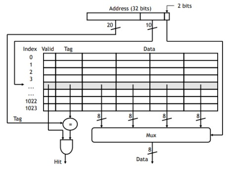

A direct-mapped cache is show in the following figure. This cache consists of 1024 4-word blocks, and
word of data is 1 byte. The cache rows are selected based on the index. Following the selection of the
desired row, the tag part of the input data is compared with the tag part of the data in the corresponding
line of the cache. The cache declares a hit when the entries match, otherwise, it announces a miss. In the
event of a hit, the correct data is selected by a circuit and is given to the output. 
 
 

 
When data is missed, the cache takes desired data from memory and replaces old data with new one. It
also changes tag so that it matches block address of new data.
 
This cache is implemented as a combination of several parts that are implemented individually. It consists
of a data array, a tag-valid array, a miss-hit logic, and a cache controller.
 
As a matter of convenience, in this exercise, in case of miss in cache, produce new data randomly and
replace old data with new ones. Also assume cache is initially empty. 
 

